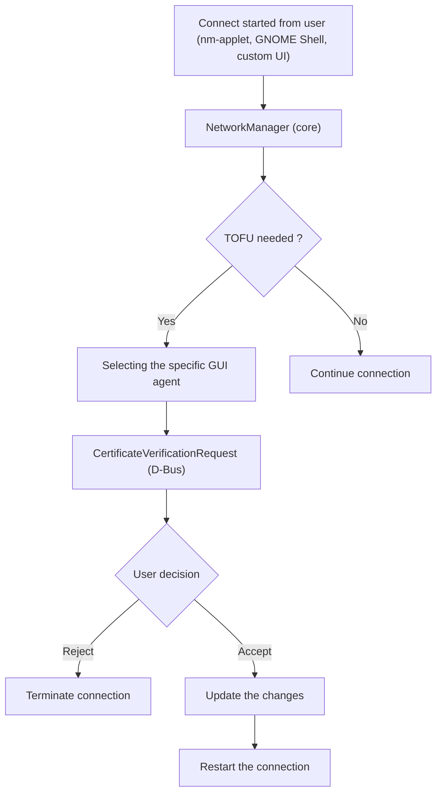

NetworkManager
==============

This repository contains a modified version of **NetworkManager** that introduces core support for **Trust On First Use (TOFU) style certificate verification** for WPA-Enterprise / TLS-based networks.

The changes are intentionally limited to **NetworkManager core** and provide a new D-Bus interface that allows certificate verification decisions to be delegated to a user-space agent (e.g. nm-applet, GNOME Shell, or a custom agent).

No UI or policy decisions are embedded in NetworkManager itself except the nmtui.


Motivation
----------

In current upstream NetworkManager, TLS certificate verification during WPA-Enterprise authentication is handled internally (with strict extreme cases, either provide a CA certificate or avoid complete validation), with no support for interactive or policy-driven workflows.

This makes it difficult to support:
- Trust On First Use (TOFU)
- Interactive certificate inspection
- Research into certificate misuse and credential-stealing attacks

This work separates **certificate verification policy** from **connection management**, enabling safer and more flexible designs to pause and resume the connection based on trust decisions.

High level design
----------





- NetworkManager detects when a certificate decision is required
- Analization of the received certificate against trusted certificates
- Certificate details are sent to a registered agent over D-Bus
- The user decides whether the certificate should be accepted or rejected
- NetworkManager resumes authentication based on the user's response

New Dbus Interface
----------

- Two new dbus interfaces are added one is to send a request and warning, user decisions are followed by a same request signal.
- Selection of the specific GUI agents are happended in NM based the GUI capabilities defined while registration.


Scope of This Repository
-----

This repository includes:
- Core NetworkManager changes
- CertificateAgent D-Bus interface definition
- Agent registration and dispatch logic
- Safe delegation of certificate decisions
- Persistent TOFU decisions

This repository **does not include**:
- User interface code
- GNOME Shell or nm-applet integration (provided separately)


Applying the Changes to Upstream NetworkManager
----

These changes are designed to be applied **as a patch** on top of upstream NetworkManager.

#### Example (Ubuntu / Debian):

```bash
git clone https://gitlab.freedesktop.org/NetworkManager/NetworkManager.git
cd NetworkManager

# Add this repository as a remote
git remote add tofu git@github.com:rathanappana/Trust_on_First_Use-NetworkManager.git
git fetch tofu

# branch out for clean implementation
git checkout -b tofu-on-upstream origin/main

# Cherry-pick or apply the TOFU commit
git cherry-pick d63e3c4

# Build and install
meson setup build
ninja -C build
sudo ninja -C build install
```

Ubuntu and other distributions regularly update NetworkManager; this approach keeps the TOFU changes isolated and reviewable.

Security considerations
-----

- NetworkManager never implicitly trusts certificates
  - Strict validation of the certificate based on provided CA certificate
  - Else no validation at all
- All acceptance decisions are explicit and delegated
- No UI code runs in privileged NM context
- D-Bus access is restricted via policy rules

Research Context
----

This work is motivated by real-world attacks against WPA-Enterprise deployments, including credential harvesting via rogue access points and misconfigured certificate validation.

The design enables controlled experimentation and safer defaults without breaking existing NetworkManager behavior.

Disclaimer
----

This is a prototype and research-oriented extension of NetworkManager. It is not an official upstream release.

Feedback, review, and discussion are welcome.


Contribute
----------

To get involved, please email us.


License
-------

NetworkManager is free software under GPL-2.0-or-later and LGPL-2.1-or-later.
See [CONTRIBUTING.md#legal](CONTRIBUTING.md#legal) and
[RELICENSE.md](RELICENSE.md) for details.


[1]: https://nmstate.io/
[2]: https://linux-system-roles.github.io/network/
[3]: https://networkmanager.dev/docs/api/latest/NetworkManager.html
[4]: https://networkmanager.dev/docs/api/latest/NetworkManager.conf.html
[5]: https://networkmanager.dev/docs/api/latest/nmcli.html
[6]: https://networkmanager.dev/docs/api/latest/nmcli-examples.html
[7]: https://networkmanager.dev/docs/api/latest/nm-settings-nmcli.html
[8]: https://networkmanager.dev/docs/api/latest/nmtui.html
